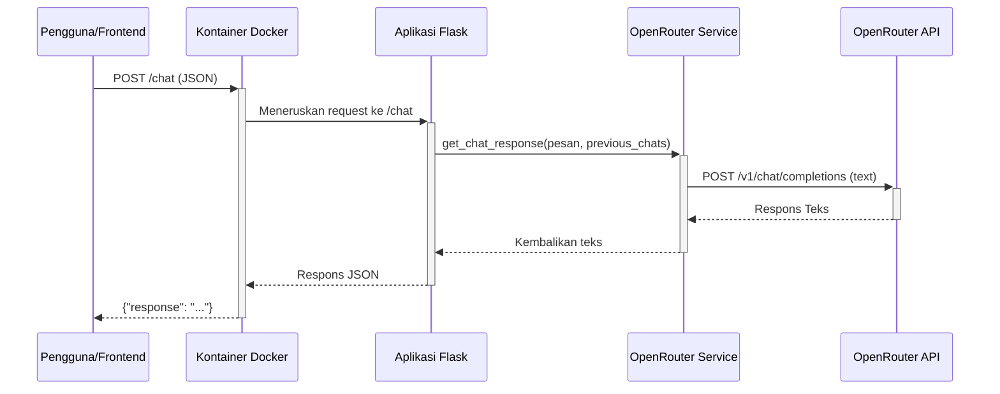
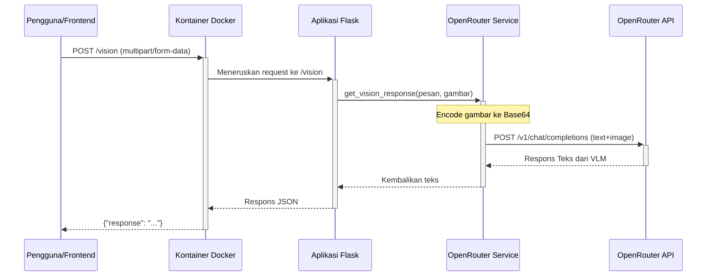
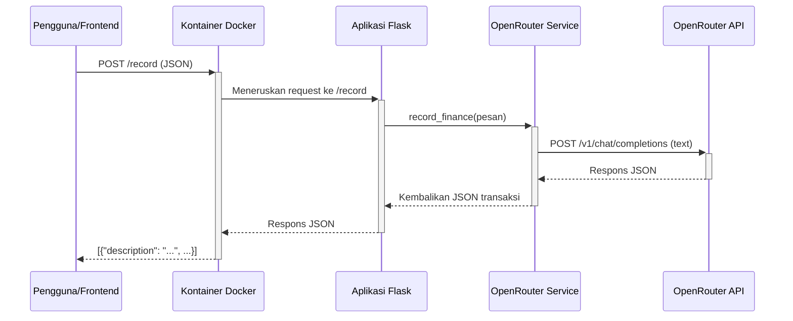
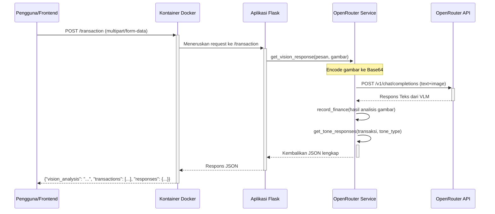

# ai-moneyvesto

## 1. Arsitektur & Alur Sistem

### Endpoint: `/chat`



Endpoint utama untuk interaksi berbasis teks.

- **URL**: `/chat`
- **Method**: `POST`
- **Headers**:
  - `Content-Type: application/json`
- **Request Body (JSON)**:
  ```json
  {
    "message": "Apa kabar hari ini?",
    "previous_chats": [
      "Halo, siapa namamu?",
      "Namaku AI Moneyvesto. Bagaimana saya bisa membantu?"
    ]
  }
  ```
- **Respons Sukses (200 OK)**:
  Mengembalikan respons teks dari model AI.
  ```json
  {
    "response": "Saya baik-baik saja, terima kasih. Ada yang bisa saya bantu?"
  }
  ```
- **Contoh Pengujian dengan cURL**:
  ```bash
  curl -X POST http://localhost:{PORT}/chat \
       -H "Content-Type: application/json" \
       -d '{
            "message": "Apa kabar hari ini?",
            "previous_chats": [
              "Halo, siapa namamu?",
              "Namaku AI Moneyvesto. Bagaimana saya bisa membantu?"
            ]
          }'
  ```

--- 

### Endpoint: `/vision`



Endpoint untuk interaksi yang melibatkan gambar dan teks.

- **URL**: `/vision`
- **Method**: `POST`
- **Headers**:
  - `Content-Type: multipart/form-data`
- **Request Body (Form Data)**:

| Key       | Type   | Description                   | Wajib |
| :-------- | :----- | :---------------------------- | :---- |
| `message` | string | Pesan teks dari pengguna. Tambahkan konteks seperti "foto nota", "foto barang", atau "aktivitas rekening". | Ya    |
| `image`   | file   | File gambar (jpg, png, webp). | Ya    |

- **Respons Sukses (200 OK)**:
  Mengembalikan objek JSON dengan deskripsi atau jawaban dari model AI berdasarkan gambar dan teks.
  ```json
  {
    "response": "Nota ini mencatat pembelian 2 barang: 1 galon air mineral seharga 22000 dan 1 bungkus roti seharga 15000."
  }
  ```
- **Contoh Pengujian dengan cURL**:
  Ganti `path/to/your/image.jpg` dengan path file gambar Anda.
  ```bash
  curl -X POST http://localhost:{PORT}/vision -F "image=@path/to/your/image.jpg"
  ```

--- 

### Endpoint: `/record`



Endpoint untuk mencatat transaksi keuangan dari pesan teks.

- **URL**: `/record`
- **Method**: `POST`
- **Headers**:
  - `Content-Type: application/json`
- **Request Body (JSON)**:
  ```json
  {
    "message": "hari ini beli 2 porsi nasi goreng 15rb dan es teh manis 5000"
  }
  ```
- **Respons Sukses (200 OK)**:
  Mengembalikan daftar transaksi dalam format JSON.
  ```json
  [
    {
      "description": "Nasi Goreng",
      "transaction_type": "withdrawal",
      "amount": 2,
      "total_price": 30000
    },
    {
      "description": "Es Teh Manis",
      "transaction_type": "withdrawal",
      "amount": 1,
      "total_price": 5000
    }
  ]
  ```
- **Contoh Pengujian dengan cURL**:
  ```bash
  curl -X POST http://localhost:{PORT}/record \
       -H "Content-Type: application/json" \
       -d '{ "message": "hari ini beli 2 porsi nasi goreng 15rb dan es teh manis 5000" }'
  ```

--- 

### Endpoint: `/transaction`



Endpoint ini adalah fitur utama yang mengintegrasikan analisis gambar, pencatatan transaksi, dan respons berbasis persona. Anda mengirimkan gambar (misalnya, struk belanja) dan API akan memprosesnya secara menyeluruh.

- **URL**: `/transaction`
- **Method**: `POST`
- **Content-Type**: `multipart/form-data`

**Request Body (Form Data)**:

| Key         | Type   | Description                                                                                              | Wajib   |
| :---------- | :----- | :------------------------------------------------------------------------------------------------------- | :------ |
| `image`     | file   | File gambar nota/struk (jpg, png, webp).                                                                 | Ya      |
| `message`   | string | Pesan teks tambahan untuk memberi konteks pada gambar. Contoh: "ini laptop yang baru saya beli 200rb"    | Tidak   |
| `tone_type` | string | Jenis nada respons: `supportive_cheerleader`, `angry_mom`, `wise_mentor`, atau `all` (default: `all`)    | Tidak   |

**Respons Sukses (200 OK)**:
Mengembalikan analisis gambar, daftar transaksi terstruktur, dan respons berbasis nada.

```json
{
  "vision_analysis": "Nota ini mencatat pembelian 2 barang: 1 galon air mineral seharga 22000 dan 1 bungkus roti seharga 15000.",
  "transactions": [
    {
      "description": "Galon Air Mineral",
      "transaction_type": "withdrawal",
      "amount": 1,
      "total_price": 22000
    },
    {
      "description": "Roti",
      "transaction_type": "withdrawal",
      "amount": 1,
      "total_price": 15000
    }
  ],
  "responses": {
    "supportive_cheerleader": "Hebat! Anda telah mencatat pembelian dengan sangat baik.",
    "angry_mom": "Kenapa beli roti lagi? Bukannya sudah ada di rumah?",
    "wise_mentor": "Mencatat pengeluaran seperti ini adalah langkah bijak untuk mengelola keuangan.",
    "all": [
      "Hebat! Anda telah mencatat pembelian dengan sangat baik.",
      "Kenapa beli roti lagi? Bukannya sudah ada di rumah?",
      "Mencatat pengeluaran seperti ini adalah langkah bijak untuk mengelola keuangan."
    ]
  }
}
```

**Contoh Pengujian dengan cURL**:

```bash
# Permintaan dengan gambar dan pesan konteks
curl -X POST http://localhost:5000/transaction \
     -F "image=@/path/to/your/receipt.jpg" \
     -F "message=Ini struk belanja bulanan di supermarket." \
     -F "tone_type=all"

# Permintaan hanya dengan gambar
curl -X POST http://localhost:5000/transaction \
     -F "image=@/path/to/your/receipt.jpg"

# Permintaan dengan persona spesifik
curl -X POST http://localhost:5000/transaction \
     -F "image=@/path/to/your/receipt.jpg" \
     -F "tone_type=angry_mom"
```